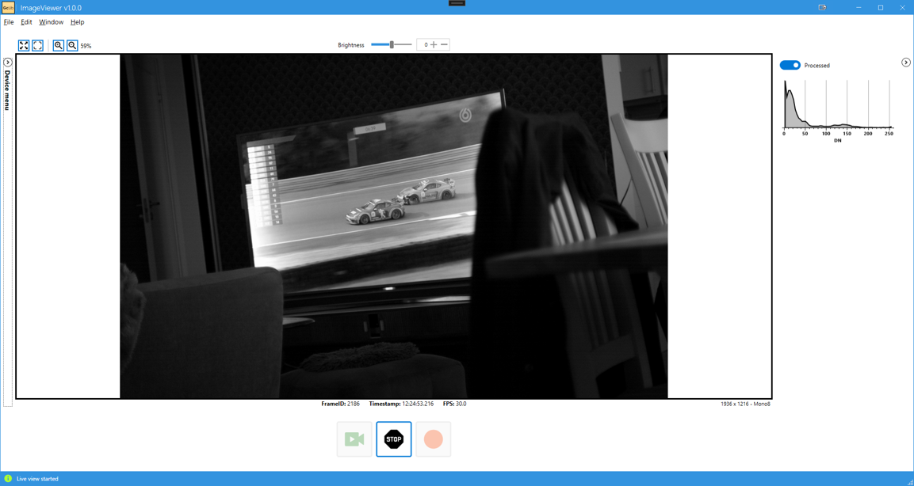

Library providing a common interface to control settings and streaming of [GenICam/GenTL](https://www.emva.org/standards-technology/genicam/)-standardized cameras in .NET, using underlying APIs from supported third-party providers.
GcLib essentially works like a wrapper around the external APIs, hiding their specific implementations and enabling the same code to be used regardless of the camera or vendor.

Currently supported APIs are: 
[eBUS SDK](https://www.pleora.com/machine-vision-connectivity/ebus-sdk/),
[xiAPI.NET](https://www.ximea.com/support/wiki/apis/xiAPINET),
[Spinnaker SDK](https://www.teledynevisionsolutions.com/products/spinnaker-sdk/?model=Spinnaker%20SDK&vertical=machine%20vision&segment=iis) and
[PCO SDK](https://www.excelitas.com/product/pco-software-development-kits) (partially implemented). 

> [!NOTE]
> Please note that some APIs may require a license.

Contributors are welcome to the project, please see this [short guide](CONTRIBUTING.md) for further info.

Demo apps have been added to the repo. A simple [console app](samples/GcLib.Samples.ConsoleApp) demonstrates the straightforwardness of setting up and using the library. A light-weight [WinForms app](samples/GcLib.Samples.WinFormsDemoApp) and a more complete [WPF demo app](samples/GcLib.Samples.WPFDemoApp) (see screenshot below) allows connection to devices detected on the system, changing device parameter settings and providing some elementary recording and playback functionality. allows connection to devices detected on the system, changing device parameter settings and providing some elementary recording and playback functionality. 

